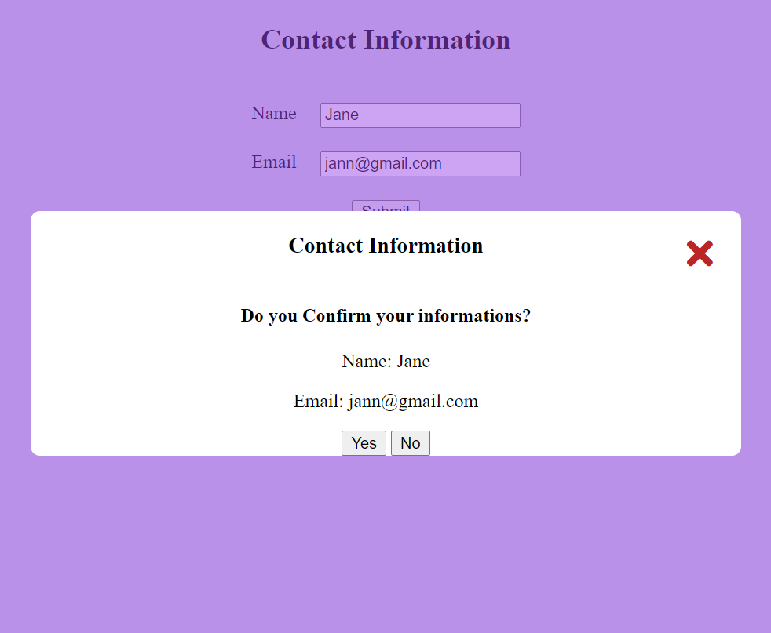

# modal

[Click to see](https://ayerdelen.github.io/modal/)

- This is a tutorial of [Free Code Camp](https://www.youtube.com/watch?v=3PHXvlpOkf4&list=WL&index=21&t=21s)

## I've learned:
- How to create and get, functionality modals with pure JS.
- Selecting multiple buttons

## I've added:
- Form elements,
- Form elements into the **modal**,
- Create **yes** - **no** button into the modal and take actions according to it.

